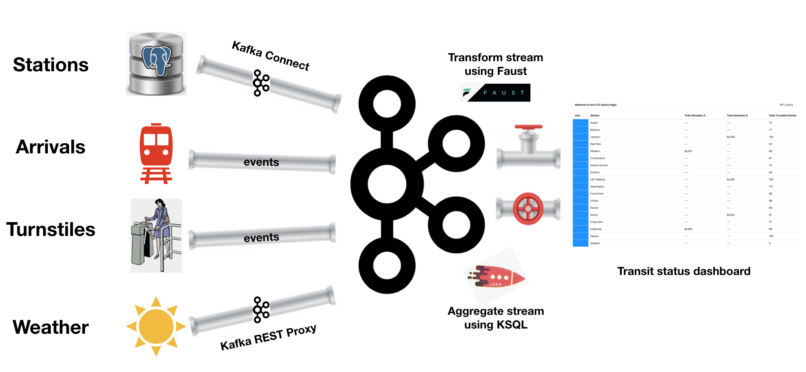

# Data-Streaming-Using-Kafka
Stream data into Kafka and process the data using KSQL and Faust

**Project Description**: The Chicago Transit Authority (CTA) is interested in developing a data dashboard that displays the system status for its commuters. As their data engineer, I was tasked to build a **real-time stream processing data pipeline** that will take the *arrival* and *turnstile* events emitted by devices installed by CTA at each train station. The *station* data is located in an in-house POSTGRES database that needs to be leveraged by the pipeline to feed into the dashboard. Lastly, CTA also wishes to display the live *weather* data - which is served through a weather REST endpoint.

**Project architecture**: Since our goal is to get data from disparate systems to the dashboard, we can make use of Kafka and its ecosystem as an intermediary. Shown below is the high-level architecture of the flow of data into and out of Kafka using various components of the Kafka ecosystem, such as: `Kafka Connect` to ingest data from the database, `Kafka REST Proxy` to interface with a REST endpoint, `KSQL` to aggregate turnstile data at each station, `Faust` to transform the stream/table before it is consumed by the web server application running the dashboard.


**Project implementation**: The entire project is implemented in Python using `confluent_kafka`, `faust`, `KSQL` and other packages. The best way to understand the implementation is to focus on the producers first and then consumers. A producer is one that will load data into our Kafka cluster. A consumer can be a stream processing application

***Producers:*** Mainly, there are 3 types of producers that emit data into the Kafka Cluster.

* **Native Kafka Producers**: The first type of producers makes use of `confluent_kafka` library to emit messages into Kafka Topics. The `KafkaProducer` base class provides core-functionality of a producer that is needed by other producers. The two producers: `Station` and `Turnstile` produce **train arrival** and **turnstile** information into our Kafka cluster. Arrivals will simply indicate that a train has arrived at a particular station and a turnstile event will simply indicate that a passenger has entered the station.
* **REST Proxy Producer**: The second type of producer is a `REST Proxy Producer`. So, this will be a python script, that simply runs and periodically emits weather data via REST Proxy and puts it into Kafka.
* **Kafka Connect Producer**: The third type of producer is simply a `Kafka Connect` JDBC source connector, which is going to connect to Postgres and extract data from a `stations table` and places it into Kafka.

***Consumers:*** On the other side of this, we are going to use 3 types of consumers that extract data from the Kafka Topics, transform them in some form and either load them back into Kafka or get consumed by the Web application running inside the web server.

* **Native Kafka Consumers**: 
* **Faust to extract and transform the Stations data and load it into a stream in Kafka**:
* **KSQL to extract and aggregate the Turnstile data**:

**Project structure**:
```bash
.
├── README.md
├── consumers
│   ├── __init__.py
│   ├── consumer.py
│   ├── faust_stream.py
│   ├── ksql.py
│   ├── logging.ini
│   ├── models
│   │   ├── __init__.py
│   │   ├── line.py
│   │   ├── lines.py
│   │   ├── station.py
│   │   └── weather.py
│   ├── requirements.txt
│   ├── server.py
│   ├── templates
│   │   └── status.html
│   ├── test_faust_stream.py
│   └── topic_check.py
├── docker-compose.yaml
├── images
│   └── project-architecture.png
├── load_stations.sql
└── producers
    ├── __init__.py
    ├── connector.py
    ├── data
    │   ├── README.md
    │   ├── cta_stations.csv
    │   ├── ridership_curve.csv
    │   └── ridership_seed.csv
    ├── logging.ini
    ├── models
    │   ├── __init__.py
    │   ├── line.py
    │   ├── producer.py
    │   ├── schemas
    │   │   ├── arrival_key.json
    │   │   ├── arrival_value.json
    │   │   ├── turnstile_key.json
    │   │   ├── turnstile_value.json
    │   │   ├── weather_key.json
    │   │   └── weather_value.json
    │   ├── station.py
    │   ├── train.py
    │   ├── turnstile.py
    │   ├── turnstile_hardware.py
    │   └── weather.py
    ├── requirements.txt
    └── simulation.py
```
